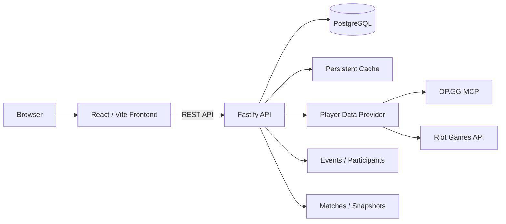

<div align="center">

# LP-Tracker

**Track League of Legends LP progression, events and player performance in one place.**

LP-Tracker combines a React/Vite frontend, a Fastify backend and PostgreSQL to track players, run LP events, display live standings and provide OBS-ready overlays.


</div>

---

## What LP-Tracker does

LP-Tracker is designed for self-hosted League of Legends LP events.

It keeps player and event state in PostgreSQL, periodically refreshes League data through the configured provider and exposes the result through a live leaderboard. Event participants receive a start snapshot when they join an event so LP progression can be calculated relative to their event starting point.

The application includes:

- Live leaderboard with LP gain, rank, win/loss record and recent matches
- Scheduled, active and completed events
- Event participant snapshots and persistent match history
- Admin interface for player and event management
- Manual and scheduled player refreshes
- OP.GG MCP provider
- Riot Games API provider
- Riot API rate-limit pacing and HTTP 429 retry handling
- Server-Sent Events for live frontend updates
- OBS overlay generator and player overlays
- Persistent leaderboard cache
- Prometheus-compatible monitoring metrics
- Health endpoint with application and build information
- Docker images for frontend and backend

---

## Tested Environment

- **PostgreSQL** V18 (18.6)
- **Docker Engine (Swarm)** 29.7.2

---

## Architecture



The frontend is built as static files and served through Nginx. The backend runs as a Node.js/Fastify service and owns all database and provider access.

For production deployments, route both services through the same public origin:

```text
/           -> frontend:80
/api/*      -> backend:3000
/metrics    -> backend:3000   # preferably internal only
```

The frontend expects API requests under `/api`, so a reverse proxy or ingress layer is required when frontend and backend run as separate production containers.

---

# Deployment

## Requirements

Production deployments require:

- Docker Engine
- A reverse proxy or ingress layer
- PostgreSQL
- Persistent PostgreSQL storage
- Network access to the selected League data provider

For source-based development you additionally need:

- Node.js
- npm
- Git

---

## Container images

The CI pipeline publishes frontend and backend images to Docker Hub:

```text
safhdev/lp-tracker:lptracker-frontend
safhdev/lp-tracker:lptracker-backend
```

Pull them with:

```bash
docker pull safhdev/lp-tracker:lptracker-frontend
docker pull safhdev/lp-tracker:lptracker-backend
```

The frontend container listens on port `80`.

The backend container listens on port `3000`.

For reproducible production deployments, pin a known image digest or release-specific tag when available instead of relying indefinitely on a rolling tag.

---

## Building from source

Clone the repository:

```bash
git clone https://github.com/Sysadminfromhell/LP-Tracker.git
cd LP-Tracker
```

Build both images:

```bash
docker build -f Dockerfile.backend -t lp-tracker-backend .
docker build -f Dockerfile.frontend -t lp-tracker-frontend .
```

The backend Docker build accepts `GIT_COMMIT_SHA` as build metadata:

```bash
docker build \
  -f Dockerfile.backend \
  --build-arg GIT_COMMIT_SHA="$(git rev-parse HEAD)" \
  -t lp-tracker-backend .
```

CI injects this automatically. Local builds fall back to `dev` when no commit SHA is supplied.

---

# Configuration

## Environment file

An example backend configuration is provided in:

```text
backend/.env.example
```

For local development:
```bash
cp backend/.env.example backend/.env
```

On Windows PowerShell:
```powershell
Copy-Item backend/.env.example backend/.env
```

Never commit real passwords, API keys or other credentials.

Docker Compose, Docker Swarm and similar platforms can provide the same values through their environment or secret mechanisms.

---

## Application

```env
NODE_ENV=production

Use `production` for production deployments. Production mode enables production-specific request and cookie security behavior.

---

## Database

Required backend settings:

```env
DATABASE_HOST=postgres.example.internal
DATABASE_PORT=5432
DATABASE_NAME=lp_tracker
DATABASE_USER=lp_tracker
DATABASE_PASSWORD=change-me
```

`DATABASE_PORT` defaults to `5432` when omitted.

The normal application user should have access only to the LP-Tracker database it needs.

### Database bootstrap

When running from source, the optional database bootstrap command can create or update the application database and role:

```bash
npm --prefix backend run db:bootstrap
```

It additionally requires:

```env
DATABASE_ADMIN_USER=postgres
DATABASE_ADMIN_PASSWORD=change-me
```

Administrative PostgreSQL credentials are not required for normal application runtime when the database and application role already exist.

### Database migrations

Database migrations run automatically during backend startup before the application begins serving traffic.

Back up the database before upgrading a production deployment.

---

## Initial admin account

When no administrator exists yet, LP-Tracker can bootstrap the first account from:

```env
ADMIN_USERNAME=admin
ADMIN_PASSWORD=change-me
```

These values do not overwrite an administrator that already exists in the database.

Use a strong, unique password in production.

Existing admin sessions are invalidated when the backend restarts, requiring administrators to sign in again.

---

# League data providers

LP-Tracker supports multiple League of Legends data providers through a common provider interface.

Supported provider values:

| Value | Provider | Additional configuration |
|---|---|---|
| `opgg` | OP.GG MCP | None |
| `riot` | Riot Games API | `RIOT_API_KEY` |

If `LEAGUE_DATA_PROVIDER` is not configured, LP-Tracker uses `opgg` by default.

## OP.GG

No provider-specific configuration is required:

```env
# LEAGUE_DATA_PROVIDER=opgg
```

## Riot Games API

Enable the Riot provider with:

```env
LEAGUE_DATA_PROVIDER=riot
RIOT_API_KEY=your-api-key
```

Personal and Development API keys have restrictive rate limits. Larger events may therefore refresh more slowly or encounter HTTP `429` rate-limit responses.

A Riot Production API key is strongly recommended for production deployments and larger events.

The Riot provider includes application-rate-limit detection, request pacing and automatic retry handling for HTTP `429` responses.

---

# Reverse proxy

LP-Tracker expects frontend and API traffic to be available through the same origin.

A production reverse proxy should route:

```text
https://tracker.example.com/          -> frontend:80
https://tracker.example.com/api/*     -> backend:3000
```

The backend also exposes:

```text
/metrics
```

This endpoint should preferably be available only to your monitoring network or Prometheus instance instead of being exposed publicly.

TLS should terminate at the reverse proxy.

LP-Tracker works with reverse proxies such as Traefik, Nginx, HAProxy or equivalent ingress solutions.

---

# Local development

Install dependencies:

```bash
npm --prefix backend ci
npm --prefix frontend ci
```

Configure the backend:

```bash
cp backend/.env.example backend/.env
```

Start the backend:

```bash
npm --prefix backend run dev
```

Start the frontend in another terminal:

```bash
npm --prefix frontend run dev
```

The Vite development server proxies `/api` requests to the local backend on port `3000`.

Typical local URLs:

```text
Frontend: http://localhost:5173
Backend:  http://localhost:3000
```

---
# Usage

## Leaderboard

Open the application root to view the current event leaderboard.

The leaderboard displays event standings, LP gain, current rank, win/loss record, recent matches, event highlights and update state.

The footer also shows the frontend version, backend version and the Git commit used for the deployed backend build. Production commit SHAs link back to the corresponding LP-Tracker commit on GitHub.

---

## Admin interface

Open:

```text
https://tracker.example.com/#admin
```

The admin interface is used to manage players and events, update social profiles and trigger manual refreshes.

### Players

Administrators can add and manage League accounts. A player must expose usable Solo Queue data through the configured provider before the account can be tracked as ranked data.

When a player is added during an active event, LP-Tracker adds that player to the active event and records the required event state.

### Events

Events move through three states:

```text
draft -> active -> ended
```

A scheduled event remains in `draft` until its configured start time.

While an event is active, LP-Tracker tracks participant LP and match changes relative to event snapshots.

Before an event is ended, participant data is refreshed so the final event state can be stored consistently.

---

## OBS overlays

The leaderboard provides access to the OBS overlay generator:

```text
https://tracker.example.com/#overlay_generator
```

Use the generator to create the player overlay URL required for your scene, then add that URL as a Browser Source in OBS.

The version footer is shown on the normal leaderboard and is intentionally not part of the OBS overlay pages.

---

# Health and monitoring

## Health endpoint

The backend exposes:

```text
GET /api/health
```

Example:

```bash
curl https://tracker.example.com/api/health
```

The response includes runtime information such as:

- Backend status
- Build version and Git commit
- Database connectivity
- Provider status and diagnostics
- Current event state
- Player/cache state
- Refresh scheduler state

This endpoint is useful for deployment verification and lightweight health monitoring.

---

## Prometheus metrics

Prometheus-compatible metrics are exposed at:

```text
GET /metrics
```

Metrics include application availability, player/cache state, provider connectivity, scheduler state, refresh success/failure counters, refresh timing and Riot API rate-limit information.

Example Prometheus scrape configuration:

```yaml
scrape_configs:
  - job_name: lp-tracker
    static_configs:
      - targets:
          - lp-tracker-backend:3000
```

Prefer scraping the backend directly from an internal monitoring network rather than exposing `/metrics` to the public internet.

---

# Updating LP-Tracker

Before updating a production deployment:

1. Create a PostgreSQL backup.
2. Record the currently deployed image digest, release or commit.
3. Pull or build the new frontend and backend versions.
4. Deploy the backend and allow startup migrations to complete.
5. Deploy/restart the frontend.
6. Verify `/api/health`.
7. Verify the leaderboard and admin login.
8. Verify `/metrics` if monitoring is enabled.

## Updating Docker images

Pull the current images:

```bash
docker pull safhdev/lp-tracker:lptracker-backend
docker pull safhdev/lp-tracker:lptracker-frontend
```

Redeploy the services using your Docker Compose, Docker Swarm, Portainer or other container orchestration configuration.

After deployment, check the build information shown in the leaderboard footer and `/api/health` to verify the running backend commit.

## Updating a source deployment

Update your local checkout:

```bash
git switch main
git pull --ff-only
```

Rebuild the images:

```bash
docker build -f Dockerfile.backend -t lp-tracker-backend .
docker build -f Dockerfile.frontend -t lp-tracker-frontend .
```

Then redeploy your containers.

Avoid blindly updating production from an unreviewed development branch.

---

# Backup and recovery

PostgreSQL contains the persistent application state, including players, events, participants, snapshots, match data and provider/cache-related state.

Back up PostgreSQL regularly and always before upgrades that include database migrations.

A container image is replaceable. The database is not.

For production environments, test restore procedures instead of relying only on successful backup jobs.

---

# Troubleshooting

## Frontend loads but API requests fail

Verify that:

- the backend is running;
- `/api/*` is routed to the backend;
- frontend and backend are reachable through the expected reverse-proxy configuration;
- the backend can reach PostgreSQL.

Check:

```text
/api/health
```

---

## Database connection errors

Verify:

- `DATABASE_HOST`
- `DATABASE_PORT`
- `DATABASE_NAME`
- `DATABASE_USER`
- `DATABASE_PASSWORD`
- PostgreSQL firewall and `pg_hba.conf` rules
- network connectivity between backend and PostgreSQL

Do not delete the database volume as a first troubleshooting step.

---

## Player data does not refresh

Check backend logs and `/api/health` for provider diagnostics.

For Riot deployments, also inspect rate-limit state and `/metrics`. Development or Personal Riot API keys may substantially reduce refresh throughput.

---

## Admin login stops working after a restart

This is expected. Existing admin sessions are invalidated during backend startup and administrators must sign in again.

---

## Version information shows `dev`

`dev` means the backend image was built without a `GIT_COMMIT_SHA` build argument.

CI builds inject the Git commit automatically. For manual builds, provide:

```bash
--build-arg GIT_COMMIT_SHA="$(git rev-parse HEAD)"
```

---

# Development and project policy

Development and Pull Request guidelines are documented in [CONTRIBUTING.md](CONTRIBUTING.md).

Security issues and vulnerability reporting are documented in [SECURITY.md](SECURITY.md).

Project repository:

https://github.com/Sysadminfromhell/LP-Tracker
