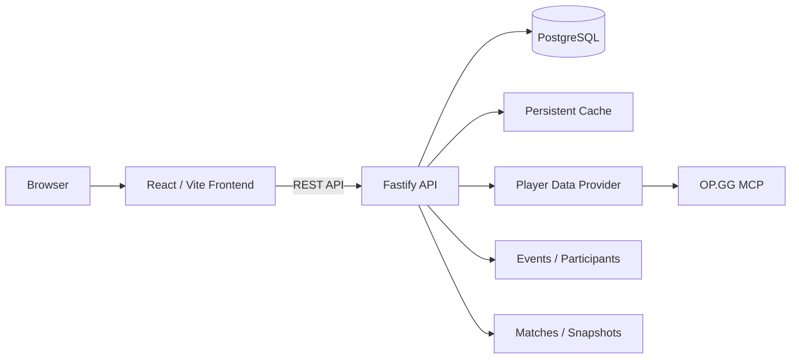

<div align="center">

# LP-Tracker

**Track League of Legends LP progression, events and player performance in one place.**

A self-hosted leaderboard and event tracker with automatic player data retrieval, persistent history, match information and an administration interface.


</div>

---

## About

LP-Tracker is a self-hosted League of Legends tracking application built around one simple idea:

> **Make LP progression and competitive events easy to follow without manually maintaining spreadsheets.**

Players can be tracked over time, displayed on a leaderboard and grouped into scheduled events. Rank, LP, wins, losses and match information are retrieved through the configured data provider and stored persistently so that progress can be compared over time.

The project consists of a React/Vite frontend, a Node.js/Fastify backend and PostgreSQL for persistent storage.

## Features

- **Leaderboard** with player rank, LP and win/loss information
- **LP progression tracking** across events
- **Scheduled events** with participants and snapshots
- **Player management** through the admin interface
- **Persistent PostgreSQL storage**
- **Persistent caching** to reduce unnecessary provider requests
- **OP.GG MCP integration** as the current player-data source
- **Provider abstraction** for future alternative data sources
- **Responsive web interface**
- **Docker-ready deployment**
- **Reverse-proxy ready architecture**

---

## Tested Environment

- **PostgreSQL** V18 (18.6)
- **Docker Engine (Swarm)** 29.7.2

---

## Architecture



At runtime the frontend is built as static files and can be served through Nginx, while the backend runs as a Node.js service.

For production deployments, a reverse proxy such as Traefik can route:

```text
/       -> frontend
/api/*  -> backend
```

---

# Usage

## Requirements

For the recommended Docker deployment:

- Docker Engine
- Docker Compose v2
- Git

For development without Docker:

- Node.js
- npm
- PostgreSQL

---

## Docker

Clone the repository:

```bash
git clone https://github.com/Sysadminfromhell/LP-Tracker.git
cd LP-Tracker
```

Build and start the stack:

```bash
docker compose up -d --build
```

Check the running containers:

```bash
docker compose ps
```

Follow the logs:

```bash
docker compose logs -f
```

Rebuild after code changes:

```bash
docker compose up -d --build
```

Stop the stack:

```bash
docker compose down
```

---

## Updating an existing installation

Pull the newest version of your current branch:

```bash
git pull
```

Rebuild the containers:

```bash
docker compose up -d --build
```

Check the logs afterwards:

```bash
docker compose logs -f
```

For production systems, it is recommended to deploy a tagged release or a known commit instead of blindly following a development branch.

---

## Development

The project is split into frontend and backend components.

### Frontend

The frontend is based on:

- React
- Vite
- TypeScript

Install dependencies and start the development server from the frontend package directory:

```bash
npm install
npm run dev
```

A production build can be created with:

```bash
npm run build
```

### Backend

The backend is based on:

- Node.js
- TypeScript
- Fastify
- PostgreSQL

Install dependencies:

```bash
npm install
```

Start the configured development script:

```bash
npm run dev
```

Create a production build:

```bash
npm run build
```

The production backend is compiled to JavaScript and runs from the generated `dist` output.

---

## Database

LP-Tracker stores its persistent application state in PostgreSQL, including data such as:

- Players
- Events
- Event participants
- Match data
- LP snapshots / progression data
- Cached provider data

Database migrations should always be applied together with the application version they belong to.

Before upgrading a production instance, create a PostgreSQL backup.

---

## Data Provider

LP-Tracker currently retrieves player information through the configured **OP.GG MCP provider**.

The backend owns the provider integration. The frontend does not communicate directly with the external provider.

This separation is intentional:

```text
Frontend
   |
   v
LP-Tracker API
   |
   v
Provider Interface
   |
   +--> OP.GG MCP
   |
   +--> Future Provider
```

This makes it possible to replace or extend the provider implementation without coupling the UI to a specific external service.

---

# Contribution

Contributions are welcome, but changes should follow a predictable workflow so that the stable version stays stable.

## Branch policy

The `main` branch represents the current stable version.

**Do not develop directly on `main`.**

Create a dedicated branch for every change.

Recommended branch names:

```text
feat/player-search
feat/event-statistics
fix/leaderboard-sorting
fix/provider-timeout
docs/readme
refactor/provider-cache
```

Supported prefixes:

| Prefix | Purpose |
|---|---|
| `feat/` | New feature |
| `fix/` | Bug fix |
| `docs/` | Documentation |
| `refactor/` | Internal refactoring |
| `chore/` | Maintenance |
| `test/` | Tests |

Example:

```bash
git switch main
git pull
git switch -c feat/my-feature
```

Commit your changes:

```bash
git add .
git commit -m "feat: add my feature"
```

Push the branch:

```bash
git push -u origin feat/my-feature
```

Then open a Pull Request against `main`.

---

## Contribution rules

Please follow these rules when contributing:

1. **Never push unfinished development directly to `main`.**
2. Keep each Pull Request focused on one logical change.
3. Make sure the project builds successfully before opening a PR.
4. Do not commit passwords, API keys, tokens, cookies or other secrets.
5. Do not commit local `.env` files containing credentials.
6. Keep database migrations compatible with the code shipped in the same PR.
7. Avoid unrelated formatting or refactoring inside a bug-fix PR.
8. Document new configuration options.
9. Update the README when a change affects installation or usage.
10. Include screenshots for visible UI changes where useful.
11. Explain breaking changes clearly in the Pull Request.
12. Resolve merge conflicts in the feature branch, not directly on `main`.

---

## Pull Requests

A good Pull Request should explain:

- **What changed?**
- **Why was it changed?**
- **How was it tested?**
- **Does it require a migration?**
- **Does it change configuration?**
- **Does it change the UI?**

For UI changes, screenshots or a short recording are strongly recommended.

Before submitting:

```bash
npm run build
```

Run any available linting or tests as well.

---

# Bugs

Found something broken? Please report it through GitHub Issues.

Before opening a new issue:

1. Check whether the bug has already been reported.
2. Verify that the problem still exists on the version you are running.
3. Collect the relevant application and container logs.
4. Remove passwords, tokens, cookies and personal information from logs.

A useful bug report should contain:

```text
Title:
Short description of the problem

LP-Tracker version / commit:
e.g. v1.0.0 or commit SHA

Deployment:
Docker Compose / Docker Swarm / local development

Browser:
e.g. Chrome 151

Steps to reproduce:
1.
2.
3.

Expected behavior:
What should have happened?

Actual behavior:
What happened instead?

Logs:
Relevant frontend/backend/container logs

Additional context:
Screenshots, event ID, player name, timestamps, etc.
```

## Docker logs

For a Docker Compose deployment:

```bash
docker compose ps
docker compose logs --tail=200
```

To follow logs live:

```bash
docker compose logs -f
```

If the problem only affects one service:

```bash
docker compose logs --tail=200 <service>
```

---

## Bug severity

When reporting an issue, the following severity levels are useful:

| Severity | Meaning | Example |
|---|---|---|
| **Critical** | Data loss, security issue or application unusable | Database corruption |
| **High** | Core feature is broken | Leaderboard cannot load |
| **Medium** | Feature works incorrectly with a workaround | Sorting incorrect |
| **Low** | Cosmetic or minor issue | Alignment / typo |

---

## Security issues

Please **do not publish credentials, tokens or sensitive logs in a public issue**.

Do not publicly disclose an exploitable vulnerability before a fix is available.

---

## Troubleshooting

### Containers do not start

Check their status:

```bash
docker compose ps
```

Then inspect logs:

```bash
docker compose logs --tail=200
```

### Frontend loads but API requests fail

Verify that:

- the backend container is running;
- the frontend is configured to reach the API;
- `/api` is routed to the backend when using a reverse proxy;
- both services are attached to the expected Docker network.

### Player data does not update

Check:

- backend logs;
- provider connectivity;
- cache state;
- whether the requested player/account can be resolved by the configured provider.

### Database errors after an update

Make sure the database migrations shipped with the installed application version have been applied.

Do not delete the PostgreSQL volume as a first troubleshooting step.

---

## Project structure

A simplified overview:

```text
LP-Tracker/
├── web/                    # React / Vite frontend
│   └── dist/               # Production frontend build
├── ...                     # Backend source
│   └── dist/               # Compiled backend
├── migrations/             # Database migrations
├── docs/
│   └── screenshots/        # README screenshots
├── docker-compose.yml
└── README.md
```

> The tree above is intentionally simplified. Keep this section synchronized with the repository if directories are renamed or reorganized.

---

## Roadmap

Ideas that fit the current architecture include:

- More event statistics
- Expanded LP progression visualizations
- Improved match analytics
- Additional player-data providers
- Better live-update behavior
- More administration and moderation tools
- Additional deployment documentation

---

## License

No license is assumed by this README.

If the project should be open source, add a `LICENSE` file and update this section with the chosen license.

---

<div align="center">

**LP-Tracker**

Built for tracking progress — not spreadsheets.

</div>
